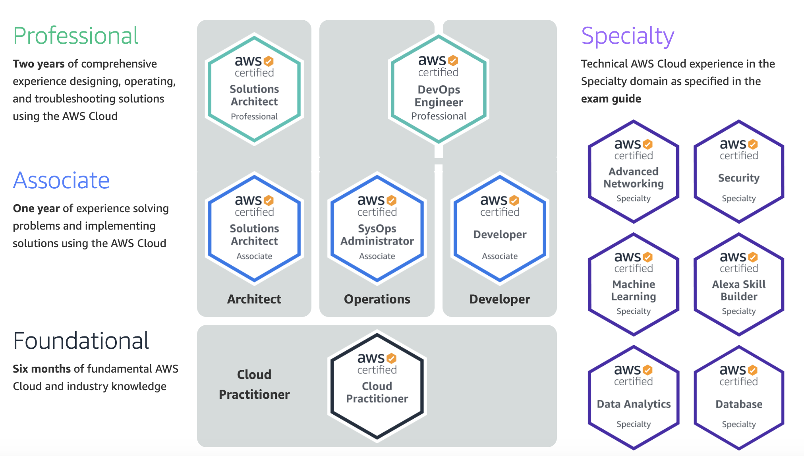

# Giới thiệu
AWS Certification là chứng chỉ được câp bởi Amazon đánh giá mức độ hiểu biết về aws cloud, cụ thể là các dịch vụ của Amazon Web Services (AWS) cũng như việc áp dụng các dịch vụ đó 1 cách hiệu quả vào trong các bài toán thực tế. Bộ chứng chỉ này được chia thành các phần: Cloud Practitioner, Architect, Developer và Operations, ngoài ra có thêm Specialty.
Về độ khó thì có 3 mức:
- Foundational
- Asociate
- Professional
Chi tiết về các chứng chỉ các bạn tham khảo ở hình dưới đây:
