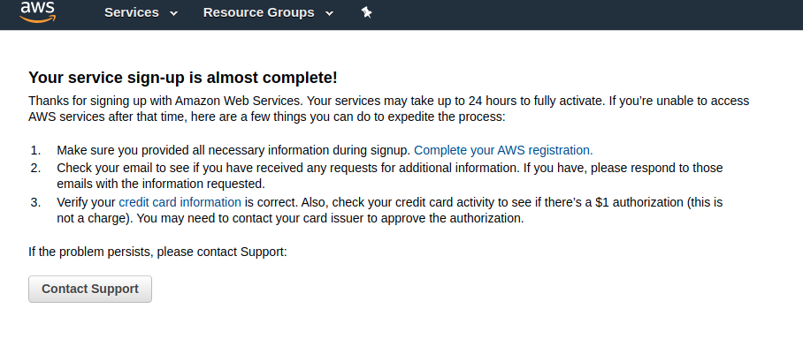

# CHUẨN BỊ
1. Thẻ Visa hoặc Master có ít nhất 1$ trong tài khoản. (Nên để 2-3$ vì 1 số TH sẽ bị trừ nhiều hơn 1$, tôi cũng bị aws kích hoạt 2 lần và bị trừ 2$).
2. Số điện thoại để xác mình, phải là số chưa từng dùng để đăng ký nhé.
3. Truy cập https://console.aws.amazon.com/ đăng kí tài khoản

# Các vấn đề gặp phải

- Lúc này chúng ta phải chờ 24h ... hoặc có thể lâu hơn. Tôi đã phải chờ gần 1 tuần để aws có thể kích hoạt. Thế nên đợi chờ sẽ là hạnh phúc!
- Giả sử chúng ta cố gắng "complete your aws registration" theo chỉ dẫn aws để được active nhanh hơn thì sẽ có các trường hợp sau:
    * TH1 -> Mọi thứ suôn sẻ, bạn bạn hoàn thành các bước và chỉ phải đợi 1-2h có thể kích hoạt.
	* TH2 -> Không thể nhận được mã PIN kích hoạt từ số điện thoại -> Xin chúc mừng bạn quay vào ô mất lượt -> Đợi 1 tuần nhé ...
		* Th 2.1 -> Không chấp nhận 1 tuần, bạn truy cập https://console.aws.amazon.com/support/home#/case/create 
				-> Tạo request yêu cầu 
				-> Bạn sẽ được tư vấn nhận điện thoại -> Và yêu cầu khai báo phone + name đăng kí tài khoản -> Và lời hứa hẹn sớm được active tài khoản -> Vâng sau 3 ngày thì tôi cũng đã được active.
